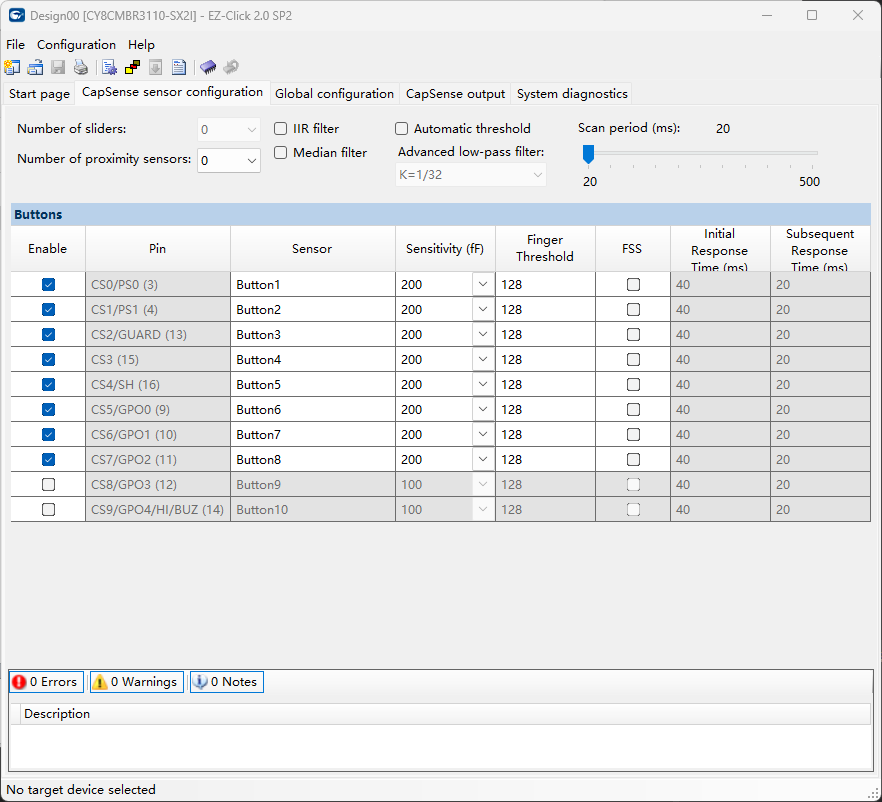

Simply finished the touchpad function, now the touchpad can be used to control the game. The touchpad is now fully functional and can be used to navigate through the game menus and control the character's movements.
The touch ic can use Cypress CY8CMBR31xx series
NEW INFO!!! Do not use CY8CMBR31xx series in this prj,the chip didn't have enough fresh rate.Will made tons of Attack in game,the whole project will move to mpr121 soon.

